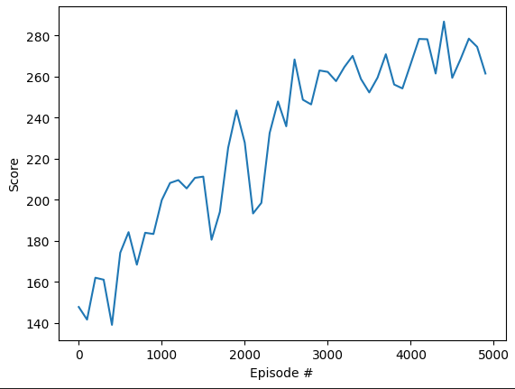
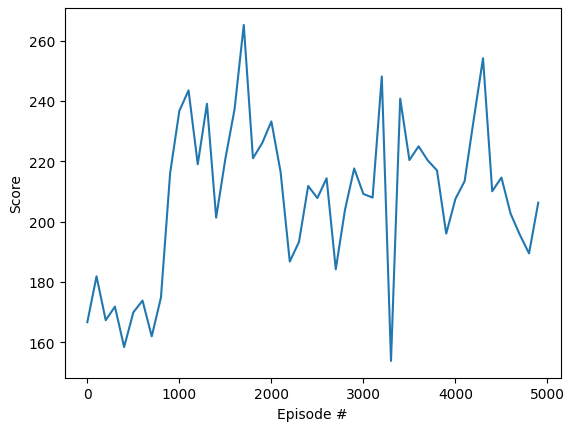

## A2C

- 1000 Episodes
    - With Death Penalty
        - 2662.07789 seconds to train
        - 705.0 Max score

        
- 5000 Episodes
    - With Death Penalty
        - 12454.68424 seconds to train
        - 825.0 Max score

        
## DDQN

- 1000 Episodes
    - With Death Penalty
        - 979.29650 seconds to train
        - 820.0 Max score

        
- 5000 Episodes
    - With Death Penalty
        - 4336.31666 seconds to train
        - 810.0 Max score

        

    - With Death Penalty and Slower Learning Rate
        - 6545.01688 seconds to train
        - 850.0 Max score
        
        

- 20000 Episodes
    
    - With Death Penalty and Slower Learning Rate
        - 18826.31251 seconds to train
        - 1065.0 Max score
        
        

- 200000 Episodes
    
    - With Death Penalty and Slower Learning Rate
        - 176856.96032 seconds to train
        - 1275.0 Max score
        
        

## DQN

- 1000 Episodes
    - Without Death Penalty
        - 6837.64849 seconds to train
        - 1020 Max score

        
    - With Death Penalty
        - 5801.82541 seconds to train
        - 785.0 Max score
        
        
- 5000 Episodes
    - Without Death Penalty
        - 31806.30933 seconds to train
        - 885.0 Max score

        
    - With Death Penalty
        - 23761.75718 seconds to train
        - 955.0 Max score
        
        
- 10000 Episodes
    - Without Death Penalty
        - 70214.89135 seconds to train
        - 965.0 Max score
        
        

## PG

- 1000 Episodes
    - With Death Penalty
        - 1514.77900 seconds to train
        - 690.0 Max score
        
        
- 5000 Episodes
    - With Death Penalty
        - 9018.64718 seconds to train
        - 855.0 Max score
        
        

## PPO

- 1000 Episodes
    - With Death Penalty
        - 2486.34871 seconds to train
        - 775.0 Max score
        
        
- 5000 Episodes
    - With Death Penalty
        - 10426.38979 seconds to train
        - 960.0 Max score

        

## Rainbow

- 1000 Episodes
    - With Death Penalty
        - 1351.53483 seconds to train
        - 800.0 Max score
        
        
- 5000 Episodes
    - With Death Penalty
        - 4278.61738 seconds to train
        - 825.0 Max score

        